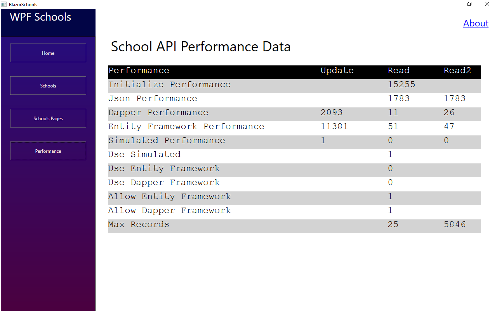

Blazor Schools Readme

Stewart Hyde

Introduction
============

This is my 2nd GitHub project and the planned was to use Blazor service as proxy
to Json web API. The original was to use the official COVID19 Json API, but
virus detection has made me change to a different API which in this case is
related to schools – this API is publicly available on the internet as
<https://code.org/schools.json>. My desired was use both SQL database and
In-memory database and filter out only content need to be transfer to client.

Another interesting thing happen that help this project. Microsoft release
Blazor Web Assembly.

I have the following goals for this project, and all have been implemented
except for the last one which I will work on after updating this project on
GitHub

-   Provide an example of calling exiting json service with a Blazer web
    assembly webservice

-   Provide in-memory or SQL storage of contents for faster retrieval of the
    information with reduce information

-    SQL Storage uses both Dapper and Entity Framework along performance testing
    of all storage API’s

-   School Json return 5000+ records so paging option is implemented for
    performance reasons

-   Blazor website has options for Simulated and existing json with no SQL for
    portability

-   Provide example of using WPF Core application to Blazer web-assembly
    webservice

-   Blazor web-assembly progressive app supported but needs to be test on other
    devices

Database services
=================

The BlazorSchools.Server support the following database storage services which
can be all loaded and configured

-   Dapper SQL Service like what is in LegacyDelivery project using store
    procedures

-   In-memory service like what is in LegacyDelivery project using in memory
    object storage

-   Entity Framework that use the same Interface as above and can be interchange
    by configuration

The external Json service call is loaded into memory and can be store to any of
the above. For normal transactions only one is configured. But there is option
to included performance comparison between the APIs’. Basically, the test loads
the API from external sites and updates configured storage and then reads from
each storage twice.

The following is example screen shot from Blazor Application showing performance
details with all storage service active

WPF Client
==========

There is also a WPF client provide which I designed to appear to be like Blazor
application with some minor difference. This project is not like the one I note
that use web output – but outputs screen using XAML controls. Table output is
not as pretty, but I am sure with some work it could be. It uses fixed font for
spacing. Implementation wise, it uses the same Http.GetFromJsonAsync calls that
Blazor apps uses. The following is example of screen

