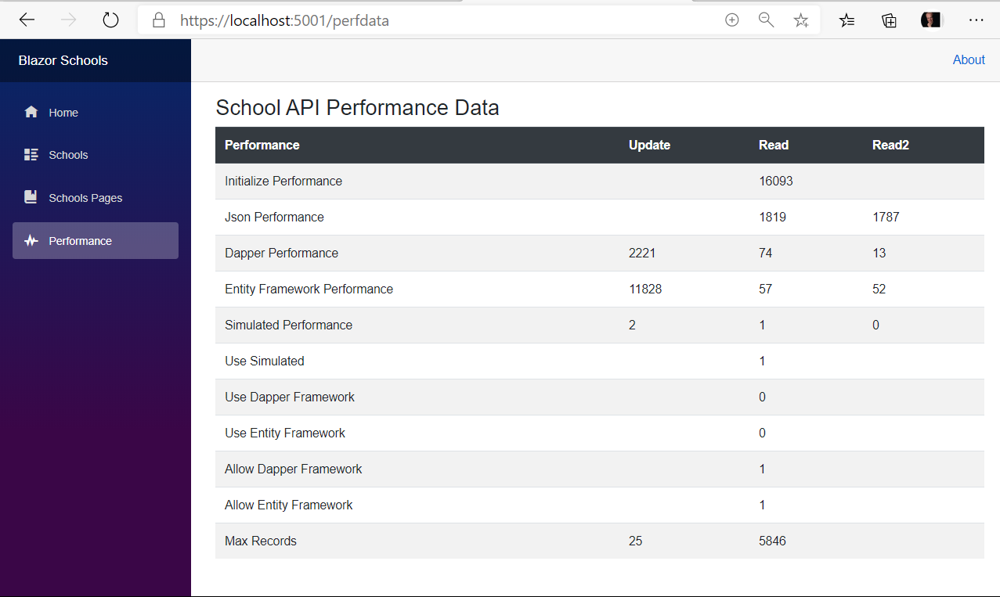
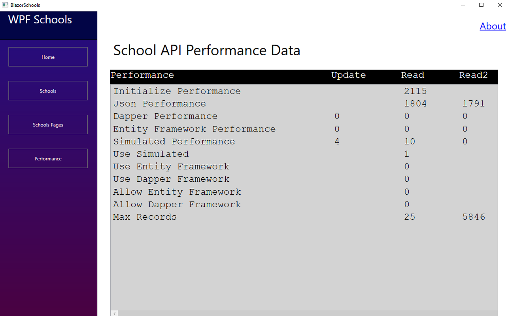
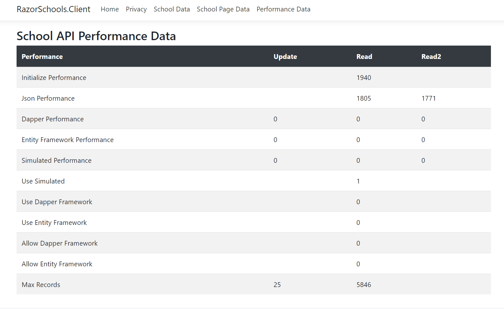
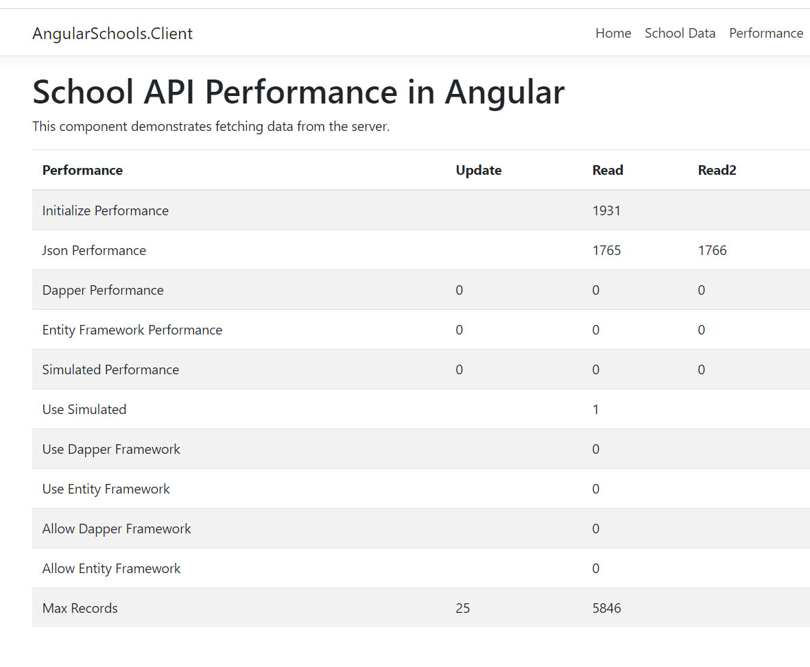
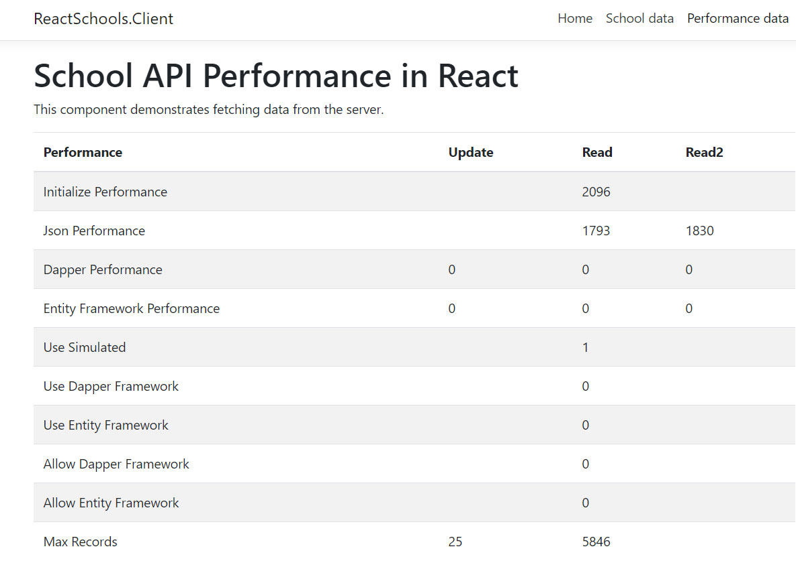

Blazor Schools Readme

Stewart Hyde

Introduction
============

This is my GitHub project and the planned was to use Blazor service as proxy to
Json web API. – this API is publicly available on the internet as
<https://code.org/schools.json>. My desired was use both SQL database and
In-memory database and filter out only content need to be transfer to client.

I been working on this GitHub project and in this project, I wanted to
experiment with Blazor Web-assembly, specifically I see if the same Web-assembly
can be called for Blazor applications and similar WPF application. I also want
to use external JSON service with 5000+ records and test the performance
differences between Dapper, Entity Framework and Simulated all in same
application.

I really like Blazor development in my previous GitHub project and I found that
with Web- assembly that it even better. Using database services with all the
same interfaces makes Dapper, Entity Framework and Simulated. Adding Entity
Framework was as simple as cloning the interface and add migration for database.
This was done in a matter of hours and I would believe it would not be much to
do any other database.

The interesting thing is performance, I found with a large number of items, that
the screen should be page and a lot of this is because Blazor is web based and
loading 5000 items on screen is rather show. The Blazor application is web bases
and rendering of 5000 items is rather slow - this can be shown in difference
between Schools and Schools Page screen. In the WPF even the loading is still
there, the difference is less but currently WPF does only shows top items.

Another interesting thing happen that help this project. Microsoft release
Blazor Web Assembly.

I have the following goals for this project, and all have been implemented
except for the last one which I will work on after updating this project on
GitHub

-   Provide an example of calling exiting json service with a Blazer web
    assembly webservice

-   Provide in-memory or SQL storage of contents for faster retrieval of the
    information with reduce information

-    SQL Storage uses both Dapper and Entity Framework along performance testing
    of all storage API’s

-   School Json return 5000+ records so paging option is implemented for
    performance reasons

-   Blazor website has options for Simulated and existing json with no SQL for
    portability

-   Provide example of using WPF Core application to Blazer web-assembly
    webservice

-   Blazor web-assembly progressive app supported but needs to be test on other
    devices

Updated: 08/09/2020

Change WPF to support Listbox to test to see if Blazor performance issue was
directly related to html page loading and this has been verify as true. Loading
of WPF even with 5000+ items is almost instant.

Updated: 08/23/2020

Added ASP.Net Razor example with same API as WPF with Performance Data and
Single and Multiple Page support.

Updated: 01/22/2021

Added ASP.Net Angular example with same API as WPF with Performance Data and
Single Page support.

Updated: 01/25/2021

Added ASP.Net Reactr example with same API as WPF with Performance Data and
Single Page support.

Updated: 01/27/2021

Updated projects to use .NET 5.0 set update.md for details on process.

Mode data and data access from BlazorSchools.Server to BlazorSchools.Shared

Database services
=================

The BlazorSchools.Server support the following database storage services which
can be all loaded and configured

-   Dapper SQL Service like what is in LegacyDelivery project using store
    procedures

-   In-memory service like what is in LegacyDelivery project using in memory
    object storage

-   Entity Framework that use the same Interface as above and can be interchange
    by configuration

The external Json service call is loaded into memory and can be store to any of
the above. For normal transactions only one is configured. But there is option
to included performance comparison between the APIs’. Basically, the test loads
the API from external sites and updates configured storage and then reads from
each storage twice.

By default, the project is setup using only Simulated Database Service, this
means Json is pull down from the service and objects are stored in memory.

To use Dapper database service, you need to do the following

1.  Specified the correct SQLDB connect string in json file

2.  Set AllowDapper to 1 in Json file for BlazorSchools.Server

3.  Set UseSIM to 0 and UseEF to 0 if desired for school queries to use Dapper
    as buffer

4.  Publish the Database in database project

To use Entity Framework database service, use need to do the following

1.  Specified the correct EFDB connect string in Json file

2.  Set AllowEF to 1 in json file for BlazorSchools.Server

3.  Set UseSIM to 0 if desired for school queries to use Entity Framework as
    buffer

4.  Run Migration on BlazorSchools.Server

The AllowXXX settings means that DataService objects will be initialized and
will acted in Performance screen and available for Schools and Schools Pages
screen. The UseXXX indicates that this service and only that service is use for
Schools and Schools Pages screens. If both UseSIM and UseEF is 0 is than Dapper
is user unless AllowDapper is 0

Having AllowDapper and AllowEF to 0 means UseSIM is 1, this is by default and
allows application to run without need for SQL server.

The following is example screen shot from Blazor Application showing performance
details with all storage service active

WPF Client
==========

There is also a WPF client provide which I designed to appear to be like Blazor
application with some minor difference. This project is not like the one I note
that use web output – but outputs screen using XAML controls. Table output is
not same but was improved with Listbox.. It uses fixed font for spacing.
Implementation wise, it uses the same Http.GetFromJsonAsync calls that Blazor
apps uses. The following is example of screen

ASP.NET Razor Client
====================

I have updated my Blazor Schools GitHub to include a ASP.Net Razor client
besides Blazor and WPF client, All clients use the same service which is using
the Blazor Web assembly with ASP.Net Core host as service.

One note on the use of Javascript in html pages.  When creating this ASP.Net
Razor addition, I wanted to make sure that Javascript was not used during the
changes.  This became a challenge with the need for Page buttons on the
screen.  For me, I believe that the use of Javascript in html violates
Separation of code from user interface.   Not only that is that increases
security concerns on the client.  I think Microsoft took significant efforts to
improve this with Microsoft Blazor.  But this update shows the older legacy
software can work together with new software. 

There is also a ASP.NET Razor client provided which use the same API and similar
Razor pages in .cshtml format. This project seam to have better performance than
Blazor application. output – It uses the same Http.GetFromJsonAsync calls that
Blazor apps uses. The following is example of screen

ASP.NET Angular Client
======================

I have updated my Blazor Schools GitHub to include a ASP.Net Angular client
besides Blazor, Razor and WPF client. All clients use the same service which is
using the Blazor Web assembly with ASP.Net Core host as service.

Note: This is uses ClientApp setup and node_modules directory is not included. I
made two solutions one with and one with client app supported applications.

The following is example of same performance screen.

Table Description automatically generated

Table Description automatically generated

ASP.NET React Client
====================

I have updated my Blazor Schools GitHub to include a ASP.Net Angular client
besides Blazor, Razor and WPF client. All clients use the same service which is
using the Blazor Web assembly with ASP.Net Core host as service.

Note: This is uses ClientApp setup and node_modules directory is not included. I
made two solutions one with and one with client app supported applications.

The following is example of same performance screen.

Table Description automatically generated

Table Description automatically generated
